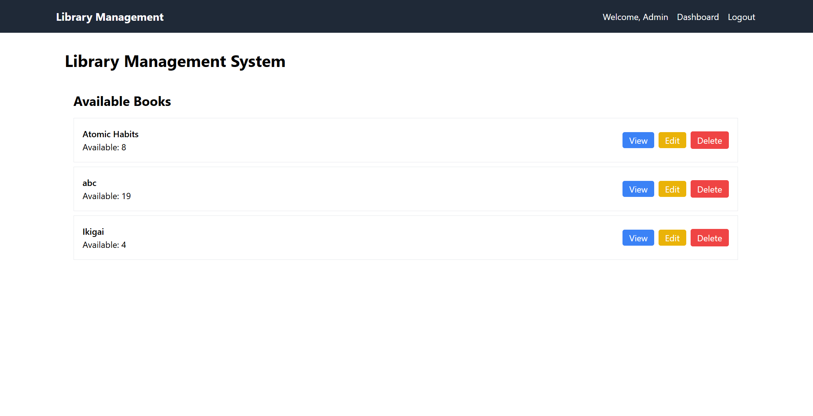
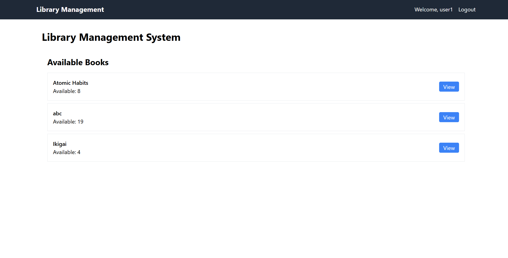
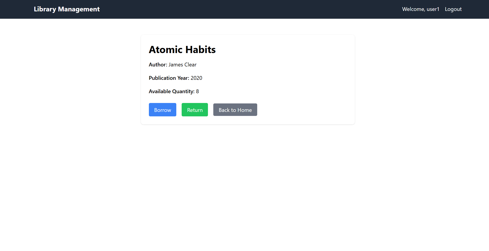
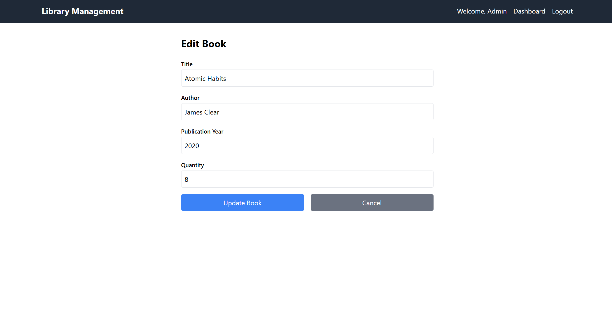
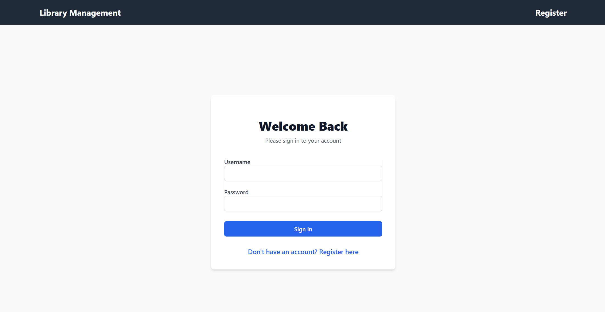
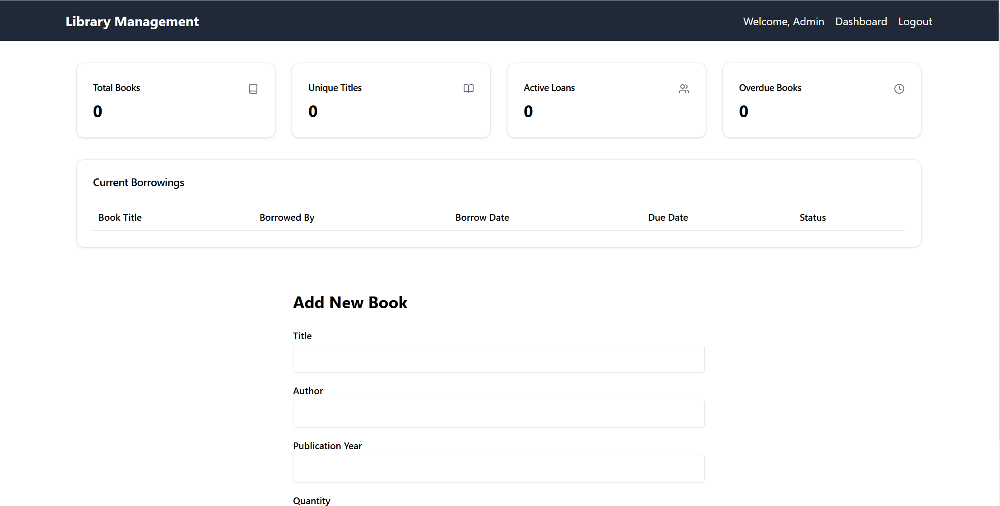

# Library Management System

Live Link

A full-stack web application for managing library operations efficiently.

## Features

### User Features
- View book details including quantity status
- Admin Homepage
- User Homepage 
- Track borrowed books and issued dates
- User authentication - users can't add or update or delete , only view and borrow/return 
- However , admin can also edit/delete 
- Sign-in and register page 

### Admin Features
- Dashboard with library analytics 
- Manage book inventory (add, edit, delete)
- For adding a book , go to Dashboard
- Track book borrowings and returns
- View user borrowing history
- Monitor overdue books

## Tech Stack

- **Frontend**: React, Tailwind CSS, ShadcnUI
- **Backend**: Node.js, Express
- **Database**: MongoDB
- **Authentication**: JWT

## To work on further

- book cover image uploads
- admin dashboard analytics not working (some issue in those api routes)
- delete function not working

## Prerequisites

- Node.js (v14 or higher)
- MongoDB
- npm or yarn

## Installation

1. Clone the repository
```bash
git clone https://github.com/yourusername/library-management-system.git
cd library-management-system
```

2. Install backend dependencies
```bash
cd server
npm install
```

3. Configure environment variables
```bash
# Create .env file in server directory
cp .env.example .env

# Add these variables to .env
MONGODB_URI=your_mongodb_uri
JWT_SECRET=your_jwt_secret
PORT=5000
```

4. Install frontend dependencies
```bash
cd ../client
npm install
```

5. Start the development servers

Backend:
```bash
cd server
npm run dev
```

Frontend:
```bash
cd client
npm run dev
```

The application will be available at `http://localhost:5173`

## API Routes

### Authentication
- `POST /api/auth/register` - Register new user
- `POST /api/auth/login` - User login

### Books
- `GET /api/books` - Get all books
- `GET /api/books/:id` - Get book details
- `POST /api/books` - Add new book (Admin)
- `PUT /api/books/:id` - Update book (Admin)
- `DELETE /api/books/:id` - Delete book (Admin)

### Borrowings
- `GET /api/books/user/borrowed` - Get user's borrowed books
- `GET /api/books/stats` - Get library statistics (Admin)
- `GET /api/books/borrowings` - Get all borrowings (Admin)

